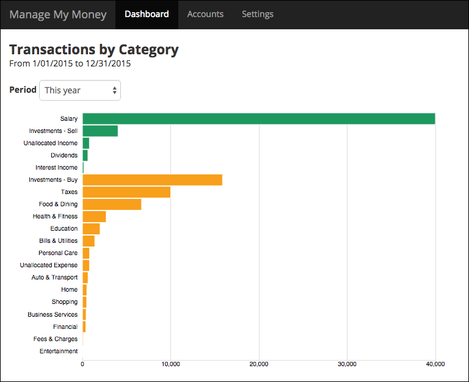

# Acceptance Testing Best Practices

*Acceptance Testing* is the process of conducting tests to determine if the requirements of a specification are met. The objective of this project is to explore best practices in acceptance testing using a variety of testing tools.

We use a full-stack application called *Manage My Money* to show how real applications are tested. Manage My Money is a personal finance manager that allows you to record and analyze your income and expenses. Here's a screen shot of the application's dashboard.

We use the [Specification-By-Example](http://www.amazon.com/gp/product/1617290084/ref=as_li_ss_tl?ie=UTF8&tag=swingwiki-20&linkCode=as2&camp=217153&creative=399701&creativeASIN=1617290084) (SBE) technique to define the requirements of the application. You can find the specification of the *Manage My Money* application [here](https://github.com/archfirst/acceptance-testing-best-practices/tree/master/cucumberjs-cucumberjs-webdriverio/test/features). We use industry leading tools such as [Cucumber](https://github.com/cucumber/cucumber/wiki/Gherkin) and [Selenium](https://seleniumhq.github.io/docs/) to drive automated testing of this specification. Each test scenario wipes out the server data before running the test. This allows each scenario to set up custom data it needs. If you do not have this level of control over your back-end you may use a different approach, e.g. use a server with a known set of test data.

If there is a testing tool or framework that is not covered by this project and you are really passionate about it, please feel free to send us a pull request with your contribution. Note that you should create a separate directory for your contribution based on the guidelines below.

## Project Structure

An acceptance testing environment consists of 3 primary components:

1. **Test runner**: A framework for running a collection of tests and reporting results

2. **Testing framework**: A framework for writing individual tests

3. **Front-end driver**: A api/tool used by a test to drive the front-end

Many testing tools cover two or more of these aspects. For example, [cucumber-js](https://github.com/cucumber/cucumber-js) is a test runner as well as a testing framework.

This project contains multiple sub-folders, each focused on a specific combination of a test runner, a testing framework and a front-end driver. For example, the folder `cucumberjs-cucumberjs-webdriverio` uses cucumber-js as the test runner as well as the testing framework, and WebdriverIO as the front-end driver. Each folder contains a README.md file that describes the specifics of the environment, e.g. the installation guide and instructions to run the tests.

## Common Setup

Before running acceptance tests in any of the sub-folders, you must set up the *Manage My Money* application and common testing tools.

### Install Manage My Money

The *Manage My Money* application consists of a server that runs on Node.js and an AngularJS client that runs on a web browser.

- Install [Manage My Money Server](https://github.com/archfirst/manage-my-money-server).
- Install [Manage My Money Client](https://github.com/archfirst/manage-my-money-client).

### Install Common Front-End Testing Tools
The steps below assume that you are using a Mac as your development machine. If you are using Windows or Linux, you should be able to follow these instructions with minor modifications applicable to your platform.

- Download the [Selenium Standalone Server](http://docs.seleniumhq.org/download/). As of this writing the latest version is 2.47.1 and the associated JAR file is `selenium-server-standalone-2.47.1.jar`. Move this file to a folder in your PATH. We keep it under `/usr/local/bin`.

- The Selenium Standalone Server requires browser specific drivers. Download the drivers of your choice and place them under `/usr/local/bin`.
    - [Chrome driver](https://sites.google.com/a/chromium.org/chromedriver/home)
    - [PhantomJS](http://phantomjs.org/): This a headless driver that runs extremely fast compared to real browsers. There is an issue running the latest version (2.0.0) on OS X. Use `upx` to work around this problem (details [here](https://github.com/ariya/phantomjs/issues/12900)).
    - Other drivers: Check out the [Selenium downloads page](http://docs.seleniumhq.org/download/)

You are now ready to go to any tool-specific folder and follow the instructions there to run the acceptance tests.